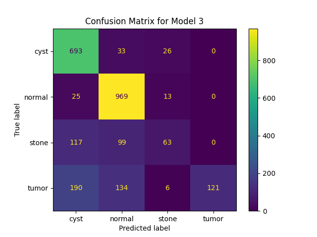
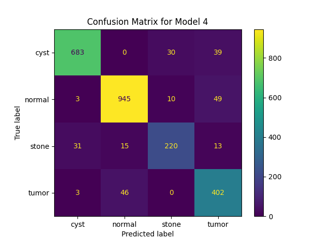

<h1>
  
  Classifying Kidneys by Condition
</h1>

Erin De Pree, PhD | [website](https://erindepree.github.io/github.io/)

## Problem Statement
For this project, my goal is to create a neural network that can correctly identify the kidney condition over 99% of the time.  This would allow the medical imaging department to process more images in a shorter amount of time.  

As with many medical applications, there will be numerous external requirements by regulatory agencies.  This project is solely focused on the developing an efficient and highly accurate (in the technical sense) model to identify the condition impacting the kidenys in each image.

## Data
I am exploring the ['CT Kidney Dataset' from Kaggle](https://www.kaggle.com/datasets/nazmul0087/ct-kidney-dataset-normal-cyst-tumor-and-stone).  These CT images are from several hospitals in Dhaka, Bangladesh.  The images are of known diagnoses (kidney stones, normal kidneys, kidney cyst, or kidney tumor).  There are total of 12,446 images.  I have included a _small_ subset of images (84 total) in this repo as examples.  

The images are taken from the front (or back) and crosswise.  

Note the images are of different sizes.  So I padded all the images out to the same size (1250x1250 pixels) while keeping the aspect ratios the same to avoid distorting the images.  

The images are distributed among the classes as

| Class  | integer | Portion of dataset |
| ------ | :-----: | :----------------: |
| Cyst   |    0    |      29.8%      |
| Normal |    1    |      40.8%      |
| Stone  |    2    |      11.1%      |
| Tumor  |    3    |      18.3%      |

Since the largest class is the normal class, for our baseline model, we will identify all images as normal.  This gives us an accuracy of $40.8\%$.  Our models should do better than this.

When loading the data, I split the it into training and validation sets.  The training set is 80% of the data.

## Model Architecture
I built a convolutional neural network with each block made of a 1-2 convolution layers and a max pooling layer.  I repeated these blocks until I had downsampled the images to a 4x4x32 block.  Then I applied two dense (or fully connected) layers to categorize the images.  

Since this is a multi-class classification problem, I used the sparse categorical crossentropy for my loss function and set my metric as the sparse categorical accuracy.  

I also built in an early stop condition to my training loop so it stops if the loss of the validation data set doesn't change very much for at least two epochs.  

I found constructing this model to be very challenging.  The first version had an accuracy of about 0.1 on the validation dataset.  But adding an additional dense layer cutting the results down to 4 parameters (one for each class) sovled this problem.  Originally, I had an output of 10 classes, but I'm not sure why, since it should be one output for each class.  When properly structured, the model works extremely well.  

After getting the base model to work, I played around with my model by adding more dense layer, then adding some drop out layers, and finally a variable learning rate.  I will discuss each of these models in detail in the next section.  Detailed summaries of all of the models are shown in my [technical report](code/kidney_image_classification.ipynb).

## Model Performance and Improvement
### Model 1: Base Model

This is my base model with just 2 dense layers at the end. I was delighted to get it working!  You can see the accuracy for both the training and validation (or test) data sets are very similar indicating the model is not overtrained and we are still in the balanced region between high bias and high variance.

Let's look at the confusion matrix for our model:

The majory of images are correctly classified, but not all.  We will look at the statistical details for all of the models after discussing each of them.

### Model 2: Additional Dense Layers
I know from the labs I had worked through previously that having another layer is more helpful than doubling the number of nodes in a layer and also runs faster.  So I added several more dense (or fully connected) layers to the end of my model.  

Model 2 is correctly identifying more tumors, but is missing more kidney stones and cysts.

### Model 3: Dropout Layers
Next I added two drop out layers in the dense layers at the end.  

I tried to pickle my models, but they didn't load probably.  Fortunately, I also discovered checkpoints and was saving the best model at the end of each epoch.  This saved my project on Thursday afternoone when I lost power while model 3 had been training for over 5 hours!  Fortunately it was almost done (high validation accuracy, very small change in the loss function).  So with the model checkpoint, and the on-screen history, I was able to salvage the run!

Happily, this model did better than model 2. 

Model 3 struggles to identify the tumors and stones correctly.  

### Model 4: Variable Learning Rate
On the Keras documentation, I learned about learning rate schedules where the learning rate starts fairly large, but then changes with the steps taken in the training loop.  

Model 4 is a significant improvement on the prior models, note the large diagonal terms in the confusion matrix (where they should be).  

### Model Comparison
Before we look at the statistics, a quick review:

$$ \text{precision} = \frac{\text{correctly predicted for class A}}{\text{total predicted for class A}}$$

Precision is the fraction of predicted members of class A that actually belong in class A.  Precision tells us how many of the predicted samples actually belong in this class.

$$ \text{recall} = \frac{\text{correctly predicted for class A}}{\text{actually in class A}} $$

Recall (or sensitivity) is the fraction of class A that we predicted belong to class A.  Recall tells us how many of the class did we catch with our test.

$$\text{F}1 = \frac{2\left(\text{precision}\right) \left(\text{recall}\right)}{\text{precision} + \text{recall}}$$

F1 helps us to balance precision and recall.

#### Precision

| Model        | Model 1  | Model 2     | Model 3  | Model 4                |
| ------------ | -------- | ----------- | -------- | ---------------------- |
| Summary      | Base     | More layers | Dropouts | Variable learning rate |
| Cyst         | $80.2\%$ | $93.9\%$    | $67.6\%$ | $94.9\%$               |
| Normal       | $96.0\%$ | $82.4\%$    | $78.5\%$ | $93.9\%$               |
| Stone        | $82.5\%$ | $71.6\%$    | $58.3\%$ | $84.6\%$               |
| Tumor        | $100\%$  | $58.9\%$    | $100\%$  | $79.9\%$               |
| Macro avg    | $89.7\%$ | $76.7\%$    | $76.1\%$ | $88.3\%$               |
| Weighted avg | $90.4\%$ | $80.4\%$    | $76.8\%$ | $90.6\%$               |

The models 1 and 4 are correctly identify most images.  Model 2 excells at identifying cysts, but struggles to properly classify tumors.  The tumors that model 3 identifies are actually tumors, but it really struggles with other classes as well.  

#### Recall

| Model        | Model 1  | Model 2     | Model 3  | Model 4                |
| ------------ | -------- | ----------- | -------- | ---------------------- |
| Summary      | Base     | More layers | Dropouts | Variable learning rate |
| Cyst         | $100\%$  | $75.3\%$    | $92.2\%$ | $90.8\%$               |
| Normal       | $93.7\%$ | $93.1\%$    | $96.2\%$ | $93.8\%$               |
| Stone        | $97.8\%$ | $38.0\%$    | $22.6\%$ | $78.9\%$               |
| Tumor        | $52.5\%$ | $78.3\%$    | $26.8\%$ | $89.1\%$               |
| Macro avg    | $86.0\%$ | $71.2\%$    | $59.4\%$ | $88.2\%$               |
| Weighted avg | $88.6\%$ | $78.9\%$    | $74.2\%$ | $90.4\%$               |

Model 1 is only identifying $52.5\%$ of the tumors as tumors while model 2 only catches $38.0\%$ of the stones.  Model 3 struggles with both stones and tumors.  Model 4 is definitely the strongest with recall.  

#### F1-Score

| Model        | Model 1  | Model 2     | Model 3  | Model 4                |
| ------------ | -------- | ----------- | -------- | ---------------------- |
| Summary      | Base     | More layers | Dropouts | Variable learning rate |
| Cyst         | $89.0\%$ | $83.5\%$    | $78.0\%$ | $92.8\%$               |
| Normal       | $94.9\%$ | $87.4\%$    | $86.4\%$ | $93.9\%$               |
| Stone        | $89.5\%$ | $49.6\%$    | $32.6\%$ | $81.6\%$               |
| Tumor        | $68.9\%$ | $67.2\%$    | $42.3\%$ | $84.3\%$               |
| Macro avg    | $85.6\%$ | $72.0\%$    | $59.8\%$ | $88.1\%$               |
| Weighted avg | $87.8\%$ | $78.4\%$    | $69.9\%$ | $90.4\%$               |

We see that model 4 is just outpacing model 1 which are both much stronger than models 2 and 3.

#### Summary
Using the weighted averages for the precision, recall, and F1-score.

| Model     | Model 1  | Model 2     | Model 3  | Model 4                |
| --------- | -------- | ----------- | -------- | ---------------------- |
| Summary   | Base     | More layers | Dropouts | Variable learning rate |
| Accuracy  | $88.6\%$ | $78.9\%$    | $74.2\%$ | $90.4\%$               |
| Precision | $90.4\%$ | $80.4\%$    | $76.8\%$ | $90.6\%$               |
| Recall    | $88.6\%$ | $78.9\%$    | $74.2\%$ | $90.4\%$               |
| F1-score  | $87.8\%$ | $78.4\%$    | $69.9\%$ | $90.4\%$               |

Clearly, the variable learning rate is extremely helpful with a larger learning rate at the beginning and then decaying over time as the model fine tunes.  

Model 4 has the best results for accuracy, precision, recall, and F1-score.  Surprisely model 1 is the second-best model.  I think this is because most of the work is done in the convolution blocks and any changes (hopefully improvements) needs to be made in those layers.

## Conclusion
None of these models are reliable enough to implement at this time.  Although model 1 is over 90% on all of the primary metrics, it is not performing well enough yet to offload some of the workload.  But this is a promising direction.  
